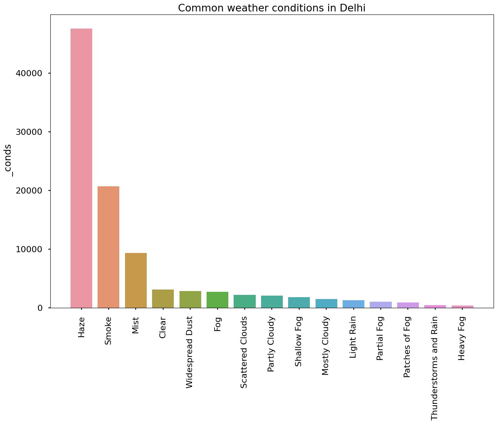
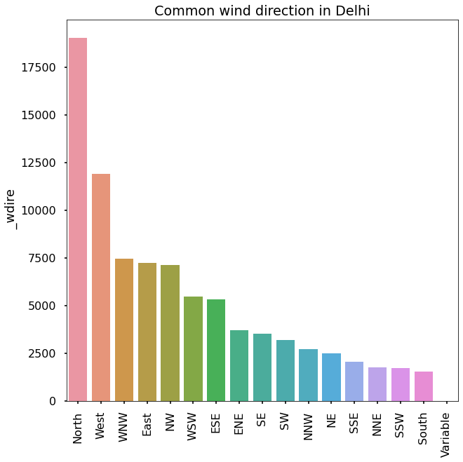
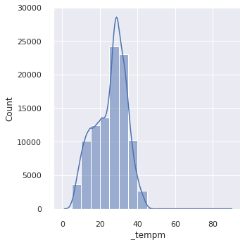
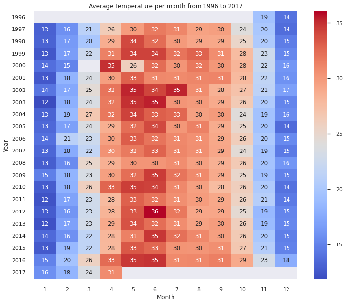
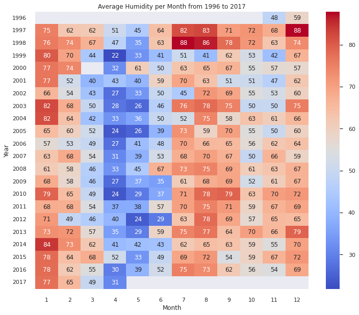
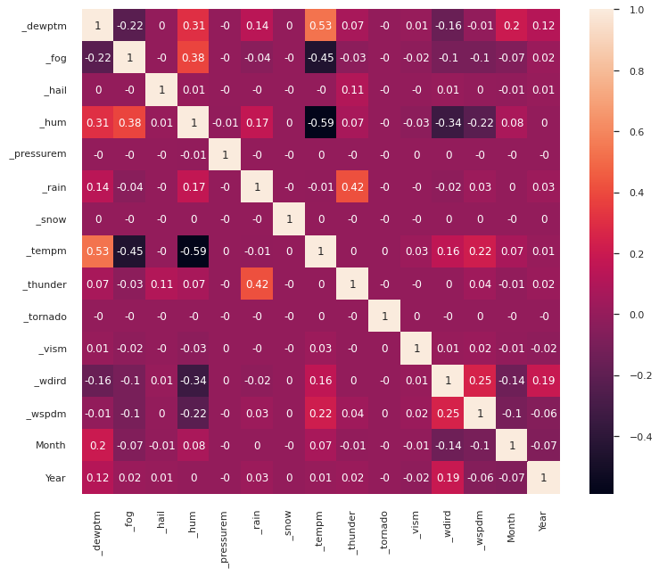
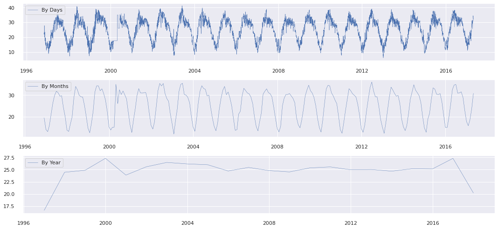
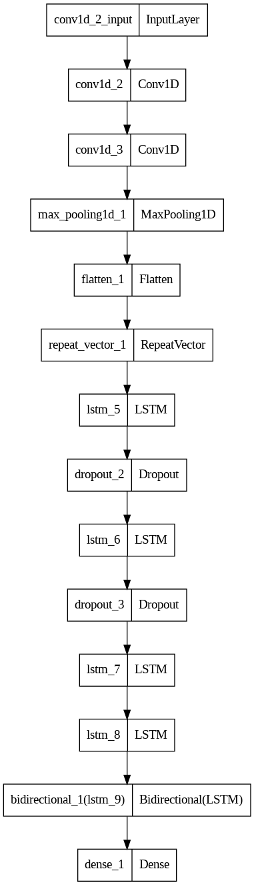
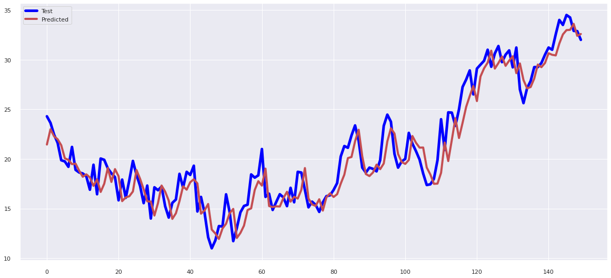

# Time_series_Temperature_Forecasting

## _Forecast the Temperature_

The dataset used in the project is Delhi temperature dataset which has temperature recorded from year 1996 to 2017 and all the records are collected pr hour. So, total entries in dataset are 100990.

## Observations:

- Common weather conditions in Delhi
  Haze and Smoke are the most common weather conditions observed in delhi

- Wind directions observed Delhi
  North and West directions are most observed for wind direction

## Temperature distribution

We can observe that the temperature of Delhi is in range of 25 to 35 degree celcius

### Heatmap to undestand the average temperature per month per year

### Heatmap to undestand the average Humidity per month per year

### Correlation between features

We can observe that Fog and Humidity are negatively correlated with Temperature

## Time series observation

We can clearly observe that data has seasonality in it.
To userstand more about data, perform Dickey Fuller Test

Results of Dickey Fuller Test:
Test Statistic               	 	       -7.165748e+00
p-value                        			2.889533e-10
no. of Lags Used               		3.600000e+01
Number of Observations Used       7.443000e+03
Critical Value (1%)           		-3.431229e+00
Critical Value (5%)           		-2.861928e+00
Critical Value (10%)          		-2.566977e+00

## Model architecture to forecast the teperature

## Output Obaservation

the model obtained Mean Square Error : 3.1448

# Thank You
